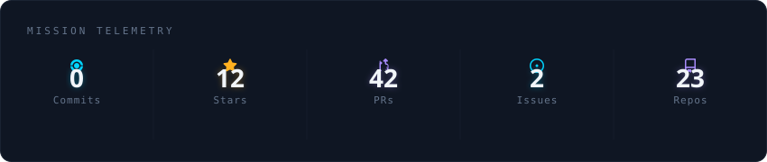

<!-- Galaxy Profile README Template
     Customize this file with your own info, then rename it to README.md
     in your GitHub profile repo (github.com/YOUR_USERNAME/YOUR_USERNAME).
     The SVG paths below point to assets/generated/ which are auto-generated
     by the GitHub Actions workflow or by running: python -m generator.main -->

  

 

  

 

  

 

  

 

<h2 align="center">📊 GitHub Stats</h2>

  

 

<strong>Sobre mim</strong>

 

Gosto de programar desde os 9 anos de idade quando descobri os .bat do DOS.

Crio ferramentas que facilitam minha vida e dos meus clientes.
**Atualmente construindo o** GITER RT - Sistema para Gestão Inteligente de Terapias Residenciais

 

  
  

 
